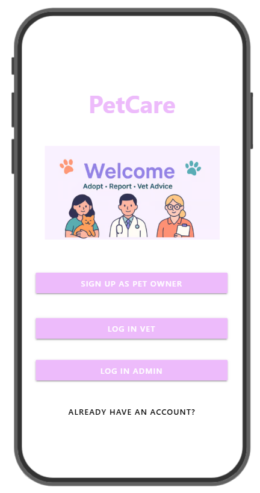

# PetCare Connect

PetCare Connect is a no-code mobile application developed using Adalo to bring essential pet care services together in one organized and user-friendly platform.
The application supports pet adoption, lost and found reports, and veterinary consultations. It was developed through a complete Software Development Life Cycle process, including requirements gathering, feasibility analysis, system design, implementation, and testing.

  

## Live Application
Explore the working PetCare Connect mobile application:

[Open PetCare Connect on Adalo](https://rahaf-al-shamis-team.adalo.com/petcare)

## Project Overview
Pet owners often depend on social media groups to find pets for adoption, report missing animals, or request veterinary advice. These platforms may contain outdated posts, limited filtering options, and unverified information.
PetCare Connect provides a structured alternative that connects pet owners, veterinarians, and administrators through one mobile application.

## Main Features
- Secure user registration and login.
- Separate roles for pet owners, veterinarians, and administrators.
- Browse and search for pets available for adoption.
- View detailed pet information.
- Add and manage adoption posts.
- Create lost and found pet reports.
- Submit medical inquiries.
- Allow veterinarians to provide advice.
- Review and approve veterinarian accounts.
- Support ratings and reviews.
- Administrative monitoring and content management.

## User Roles

### Pet Owners
Pet owners can browse adoption listings, publish pet posts, report lost or found pets, and submit veterinary inquiries.

### Veterinarians
Veterinarians can create professional profiles and respond to medical inquiries after their accounts are reviewed and approved.

### Administrators
Administrators can monitor application content, manage users, and approve or reject veterinarian registrations.

## Software Development Life Cycle
The project covered the following SDLC stages:

1. **Planning and Investigation**  
   The project problem, objectives, scope, users, and required resources were identified.

2. **Requirements Gathering**  
   Requirements were collected using an online survey, a semi-structured interview, and an analysis of existing pet-care platforms.

3. **Feasibility Analysis**  
   Technical, economic, operational, legal, and schedule feasibility were evaluated. A cost-benefit analysis was also prepared using hypothetical financial estimates.

4. **Technology Evaluation**  
   Adalo and WordPress were compared based on cost, performance, scalability, customization, and ease of implementation.

5. **System Design**  
   User roles, functional and non-functional requirements, application screens, user flows, data collections, and system behavior were designed.

6. **Development**  
   The mobile application was implemented using Adalo, including application screens, forms, navigation, data collections, and role-based workflows.

7. **Testing**  
   Functional test cases, User Acceptance Testing, and a Requirements Traceability Matrix were used to validate the application requirements.

## Development Methodology

Agile was selected because it supports:
- Iterative development.
- Continuous user feedback.
- Flexible requirements.
- Incremental feature delivery.
- Early identification of issues.
- Continuous application improvement.

## Tools and Technologies
- Adalo
- No-Code Mobile Development
- Google Forms
- Cloud-Based Data Collections
- Microsoft Word
- Flowchart and System Design Tools

## Skills Demonstrated
- No-Code Mobile App Development
- Software Development Life Cycle
- Requirements Gathering and Analysis
- Functional and Non-Functional Requirements
- Feasibility Analysis
- Cost-Benefit Analysis
- Agile Methodology
- UI/UX Design
- User Flow Design
- Database and Collection Design
- Role-Based Access Design
- Software Testing
- User Acceptance Testing
- Requirements Traceability
- Technical Documentation
- Project Planning
- Analytical Thinking

## Documentation
The complete project documentation is available here:

[View the SDLC Project Report](documentation/petcare-connect-sdlc-report.pdf)

## Project Status
The project was developed as an academic mobile application prototype.

Possible future improvements include:
- Real-time messaging.
- Location-based lost-pet notifications.
- Online appointment booking.
- Payment integration.
- Verified veterinarian profiles.
- Enhanced multilingual support.
- AI-based pet recommendations.
- Missing-pet image matching.

## Author
**Rahaf Alshami**
